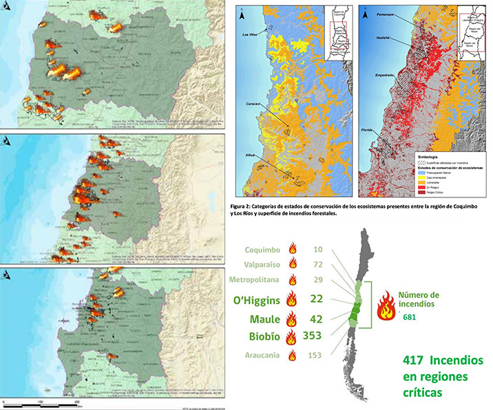

# Tormenta de Fuego, Chile 2017

## “Mega Incendio ocurrido en enero y febrero de 2017, es la catástrofe forestal más grave de nuestra historia”

### Introducción

A inicios del año 2017, en el secano costero chileno acontecieron una suma de incendios mega forestales que afectaron principalmente siete regiones del país. Este hecho fue denominado por especialistas como una “Tormenta de Fuego”, dada su inusual gravedad que da paso a una nueva generación de incendios a escala mundial, la que según expertos de la Unión Europea tiene como causa principal el calentamiento global.

La situación acontecida en el territorio nacional, se convirtió rápidamente en un episodio de escala mundial, puesto que supera la “quinta generación” de incendios dada su intensidad en la línea de fuego y la velocidad de propagación (UE 2017; CONAF 2017). 

Durante este tiempo, se establecieron más de 500 focos de incendios activos, que sumado a la escasez hídrica, las extensas plantaciones forestales, el aumento de las temperaturas del verano sobre 35 y 40 grados Celsius, y la intensidad de los vientos, se combinaron de modo tal que el fuego adquirió características de incontrolables, lo que da paso a la denominación de este fenómeno como tormenta de fuego.

Rescátamos la línea gráfica presentada en esta ilustración, queremos mostrar un contraste de texturas a través de un efecto acuarela.

### Efectos regionales en uso de suelo:

Si bien se estima que la extensión total de territorios afectados fue cercana a las 500.000 hectáreas, el catastro efectuado por tipos de uso de suelo da cuenta de una cifra de 467.538 hectáreas entre las regiones de Coquimbo y La Araucanía, siendo la región del Maule la más afectada con alrededor de 280.000 hectáreas. Por tipo de uso suelo, el destinado a plantaciones forestales fue el más afectado, también con alrededor de 280.000 hectáreas. 

|   Región  | Bosque Nativo | Matorral y Praderas | Plantaciones | Uso Agrícola |  Otros |  Total  |
|:---------:|:-------------:|:-------------------:|:------------:|:------------:|:------:|:-------:|
| O'Higgins |     34.648    |        10.325       |    34.399    |     8.609    |   146  |  88.127 |
|   Maule   |     29.588    |        51.055       |    185.875   |    12.551    |   862  | 279.931 |
|  Bío-Bío  |     12.894    |        15.177       |    60.280    |    10.357    |   772  |  99.480 |
|   Total   |     77.130    |        76.557       | **280.554**  |    31.517    |  1.780 | 467.538 |
|     %     |      16,5%    |         16,4%       |    **60%**   |      6,7%    |   0,4% |   100%  |

Contexto: Santiago tiene 64.100 ha (aproximadamente 7 Santiagos en 18 días)

Acá vemos algunos mapas que muestran las zonas afectadas.

Rescatamos: La calidad del mapa y cómo los colores muestran las zonas afectadas.

Cambiaríamos: Por un mapa de las regiones afectadas, mostraríamos;
1) Las hectáreas afectadas (bosque nativo, plantaciones, matorral, agrícola).
2) Los focos de incendio.

### Efectos por región en la flora y la fauna 

Rescatamos: Los gráficos figurativos de las especies, cómo se ubican en una locación.

Cambiaríamos: Por plantas, cuáles especies de plantaciones y especies en categoria de conservación fueron más afectadas.

-Plantaciones: Pino, Eucaliptus, y otros.

-En categoría de conservación: Palma, Puya, Qeule

## Referentes

### Referentes Bibliográficas «TORMENTA DE FUEGO» 
+ [CONAF TORMENTA DE FUEGO](https://www.conaf.cl/tormenta_de_fuego-2017/DESCRIPCION-Y-EFECTOS-TORMENTA-DE-FUEGO-18-ENERO-AL-5-FEBRERO-2017.pdf)
+ https://www.cr2.cl/incendios/
Incendios forestales en Chile de 2017 (datos)
+ https://es.wikipedia.org/wiki/Incendios_forestales_en_Chile_de_2017

### Antecedentes de infografías 
+ https://graphics.reuters.com/BRAZIL-WILDFIRE/0100B25610Q/index.html
+ https://graphics.reuters.com/AUSTRALIA-BUSHFIRES-WILDLIFE/0100B5672VM/index.html
+ https://graphics.reuters.com/AUSTRALIA-BUSHFIRES/0100B30H252/index.html
+ https://graphics.reuters.com/AUSTRALIA-BUSHFIRES-SIZE%20/0100B4QG2FG/index.html
+ https://graphics.reuters.com/AUSTRALIA-BUSHFIRES-SATELLITEIMAGES/0100B4R62H1/index.html
+ https://graphics.reuters.com/AUSTRALIA-BUSHFIRES-SCALE/0100B4VK2PN/index.html
+ https://graphics.reuters.com/AUSTRALIA-BUSHFIRES-SMOK/0100B4W52R7/index.html
+ https://graphics.reuters.com/AUSTRALIA-BUSHFIRES-WILDLIFE/0100B5672VM/index.html
+ https://graphics.reuters.com/CALIFORNIA-WILDFIRES/xegvboxrypq/index.html
+ https://graphics.reuters.com/CALIFORNIA-WILDFIRE/AIRCRAFT/bdwpkzmyyvm/index.html
+ https://graphics.reuters.com/CLIMATE-WILDFIRES/lbvgnrqjepq/+ 
+ https://graphics.reuters.com/USA-WILDFIRES/WINE/bdwpkkmxmpm/index.html
+ https://graphics.reuters.com/USA-WILDFIRE/POLLUTION/xlbpgjgervq/index.html
